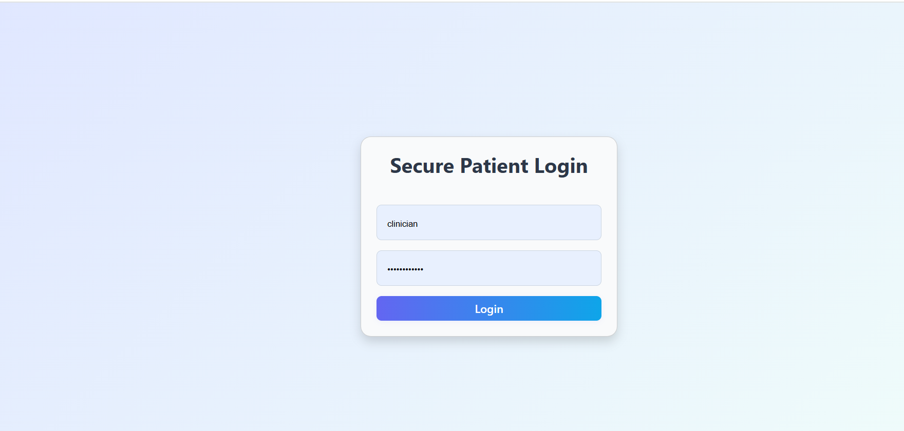

# Secure Patient Intake - Monorepo

## Screenshots

### Login Page


### Dashboard


---

## Frontend (`frontend/`)

- **Tech Stack:** React, TypeScript, Vite, React-Bootstrap, Cypress
- **Features:**
  - Responsive, modern UI for login and dashboard
  - Role-based access control (RBAC)
  - Masked SSN for non-clinicians
  - Audit logging for patient actions
  - Cypress E2E tests

### Getting Started
```sh
cd frontend
npm install
npm run dev
```
- App runs at `http://localhost:5173`

### Testing
```sh
npm run cypress:run
```

---

## Backend (`backend/`)

- **Tech Stack:** Node.js, Express, TypeScript
- **Features:**
  - REST API for patient CRUD
  - Role-based authentication (basic auth)
  - Audit logging endpoint (`/api/audit`)
  - In-memory or file-based storage (see `src/data/`)

### Getting Started
```sh
cd backend
npm install
npm run dev
```
- API runs at `http://localhost:5000`

### Endpoints
- `POST /api/audit` — Log audit actions
- `GET /api/patients` — List patients
- `POST /api/patients` — Create patient
- `PUT /api/patients/:id` — Update patient
- `DELETE /api/patients/:id` — Delete patient

---

## Security & Audit
- Only clinicians can add/edit/delete patients or view full SSN.
- All patient actions are logged with user, role, timestamp, action, and patient ID.

---

## Author
Senior Engineer Coding Exercise
